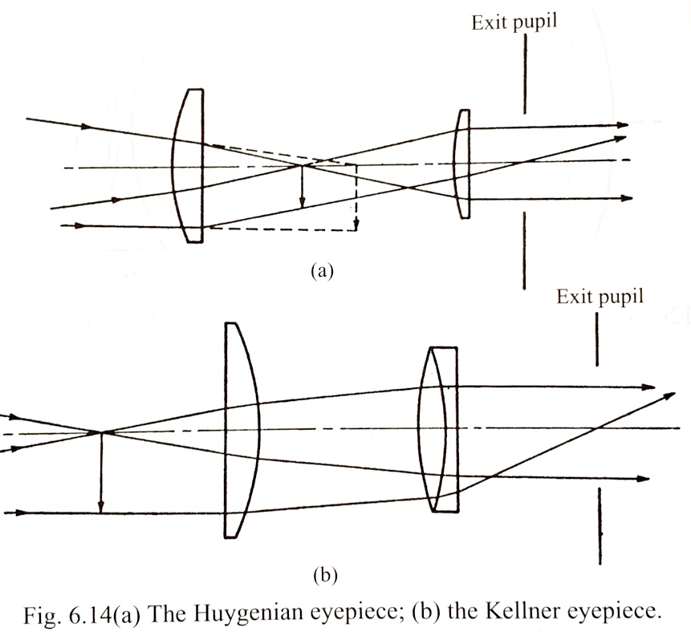
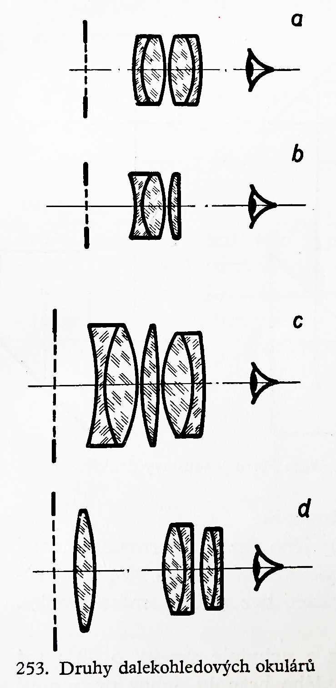
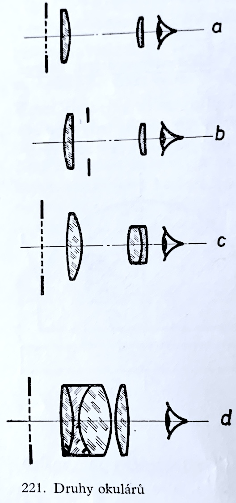

# Projekt dalekohledu pro předmět TKC

Dalekohled se bode skládat z objektivu, ostřícího členu a okuláru s určením pro pozemní pozorování. Jako převracecí mechanismus bude použito zrcátko.

[Stránky Meopty](https://eshop.meopta.cz/spektivy/) s inspirací.

## Rozvržení

Konstrukce je inspirována spektivem [Meopta MeoStar S2](https://eshop.meopta.cz/spektivy-meostar-s2/spektiv-meostar-s2-82-hd-sikmy/) tento spektiv má ohniskovou vzdálenost objektivu 439 mm.

Jako objektiv bude sloužit achromatický dublet. Například firma Edmund Optics [nabízí](https://www.edmundoptics.com/c/achromatic-lenses/652/#29374=29374_s%3ANS4wMCAtIDUuOTk1&29374=29374_s%3ANC4wMCAtIDQuOTk1&27560=27560_s%3AVklTIDAmZGVnOyAoNDI1LTY3NW5tKQ2&27560=27560_s%3AVklTLU5JUiAoNDAwLTEwMDBubSk1&27560=27560_s%3ATWdGPHN1Yj4yPC9zdWI-ICg0MDAtNzAwbm0p0&27560=27560_s%3ATWdGPHN1Yj4yPC9zdWI-ICg0MDAtNzAwbm0p0&27560=27560_s%3AVklTIDAmZGVnOyAoNDI1LTY3NW5tKQ2&27560=27560_s%3AVklTLU5JUiAoNDAwLTEwMDBubSk1&27560=27560_s%3AVVYtVklTICgzNDUtNzAwbm0p0&27614=27614_d%3A%5B59.18%20TO%2089.47%5D) takové dublety, které vyhovují průměrem ohniskem. Další výhodou je knihovna dílů v programu Zemax Optics Studio.

Jako okulár se jeví vhodné použít Kellnerův nebo Širokoúhlý okulár [[1](#lit)].<!-- Odkaz fuguje! --> Schéma okulárů lze vidět na obrázcích [[1,2](#lit)].

 

(c-d) Širokoúhlé okuláry.

(c) Kellnerův okulár.

Pokud bude cílem dosáhnout zvětšení zhruba 20x, pak očekávané ohnisková délka okuláru je 20 mm.

## Výběr komponent

#### Objektiv

__Možnosti__

[Vyhledávání v Edmundu s výsledky pro objektiv](https://www.edmundoptics.com/c/achromatic-lenses/652/#29374=29374_s%3ANS4wMCAtIDUuOTk1&29374=29374_s%3ANC4wMCAtIDQuOTk1&27560=27560_s%3AVklTIDAmZGVnOyAoNDI1LTY3NW5tKQ2&27560=27560_s%3AVklTLU5JUiAoNDAwLTEwMDBubSk1&27560=27560_s%3ATWdGPHN1Yj4yPC9zdWI-ICg0MDAtNzAwbm0p0&27560=27560_s%3ATWdGPHN1Yj4yPC9zdWI-ICg0MDAtNzAwbm0p0&27560=27560_s%3AVklTIDAmZGVnOyAoNDI1LTY3NW5tKQ2&27560=27560_s%3AVklTLU5JUiAoNDAwLTEwMDBubSk1&27560=27560_s%3AVVYtVklTICgzNDUtNzAwbm0p0&27614=27614_d%3A%5B59.18%20TO%2089.47%5D). 

- [kandidát na okulár](https://www.edmundoptics.com/p/25mm-dia-x-40mm-fl-mgfsub2sub-coated-achromatic-doublet-lens/2285/)
- [kandidát na objektiv](https://www.edmundoptics.com/p/75mm-dia-x-300mm-fl-vis-nir-coated-achromatic-lens/30852/)
- [náhradník na objektiv](https://www.edmundoptics.com/p/635mm-dia-x-3549mm-fl-achromatic-lens/2017/)

__staré__
> * [edmund](https://www.edmundoptics.com/c/achromatic-lenses/652/#27560=27560_s%3ATWdGPHN1Yj4yPC9zdWI-ICg0MDAtNzAwbm0p0&27560=27560_s%3AVklTIDAmZGVnOyAoNDI1LTY3NW5tKQ2&27560=27560_s%3AVklTLU5JUiAoNDAwLTEwMDBubSk1&27560=27560_s%3AVVYtVklTICgzNDUtNzAwbm0p0&27614=27614_d%3A%5B89.04%20TO%20140.00%5D)
> * [nejlepší kandidát od Edmundu](https://www.edmundoptics.com/p/90mm-dia-x-8499mm-fl-achromatic-lens-mtd-/11255/) za něj přidat [toto](https://www.edmundoptics.com/p/635mm-dia-x-3549mm-fl-achromatic-lens/2017/) pro zkrácení, případně si pomoct [pozitivním meniskem](https://www.thorlabs.com/newgrouppage9.cfm?objectgroup_id=130)
> * [čočka f_1](https://www.edmundoptics.com/p/25mm-dia-x-25mm-fl-mgfsub2sub-coated-achromatic-doublet-lens/20105/) prum 25 mm ohnisko 25

## Literatura 

[1] Fuka Josef, Havelka Bedřich: _Optika a atomová fyzika_. SPN Praha 1961.

[2] Born Max, Wolf Emil: _Principles of optics_. Seventh anniversary ed, Cambridge University Press.
