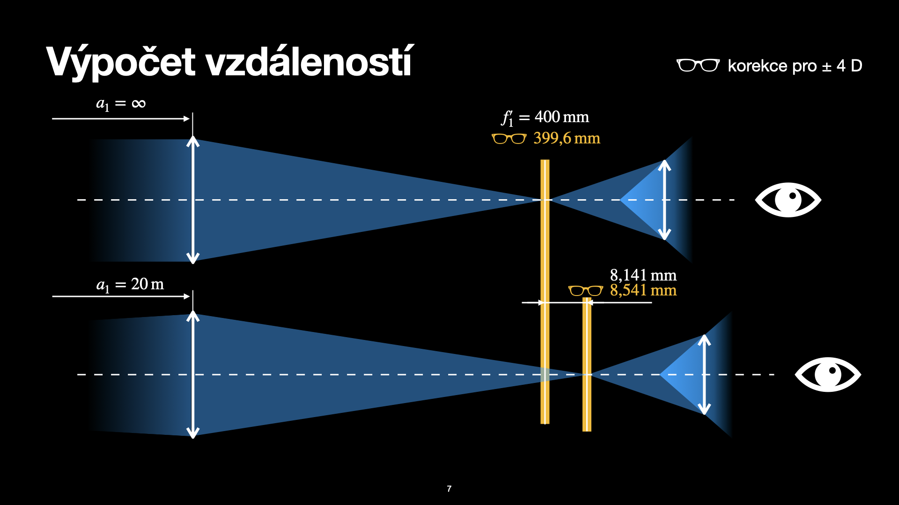
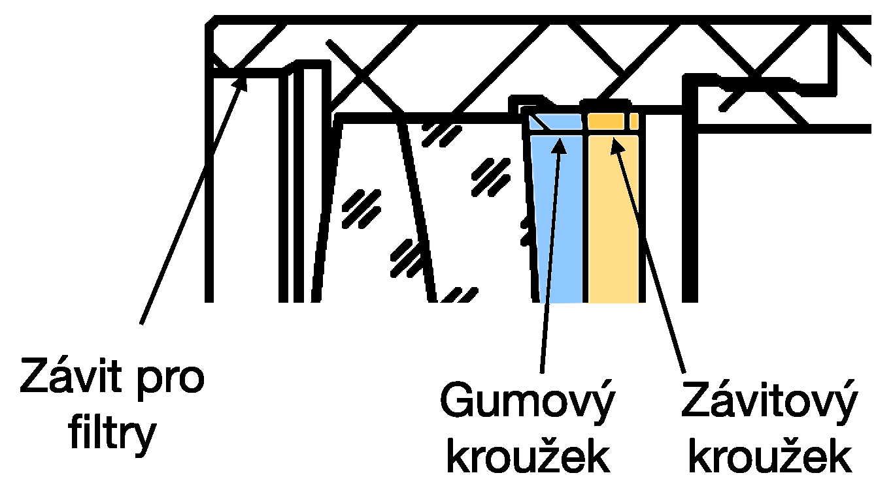
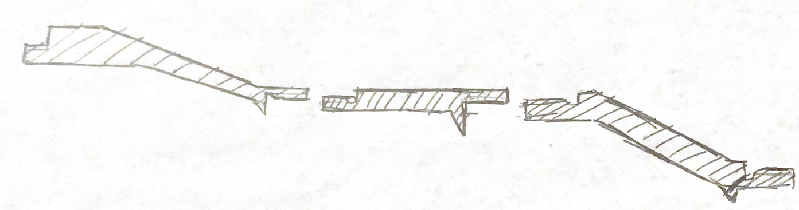
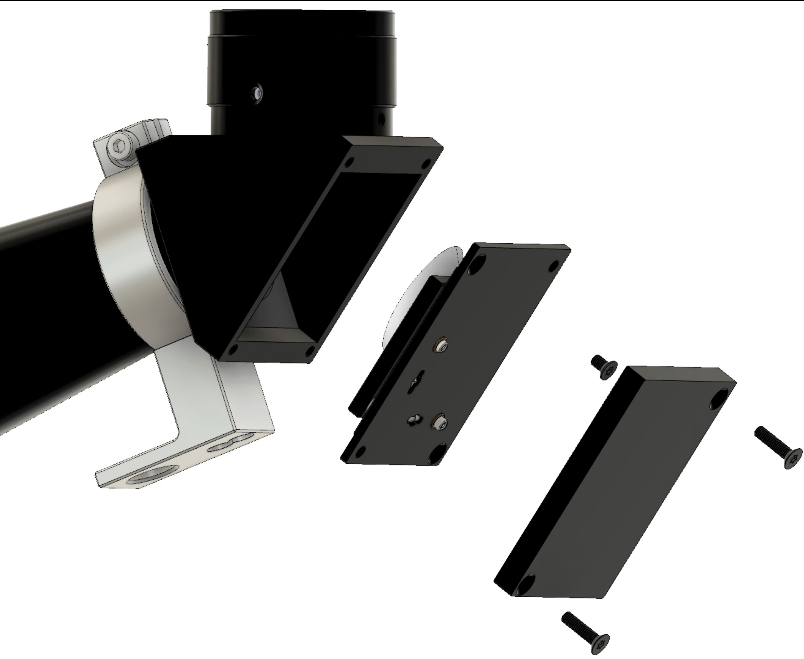
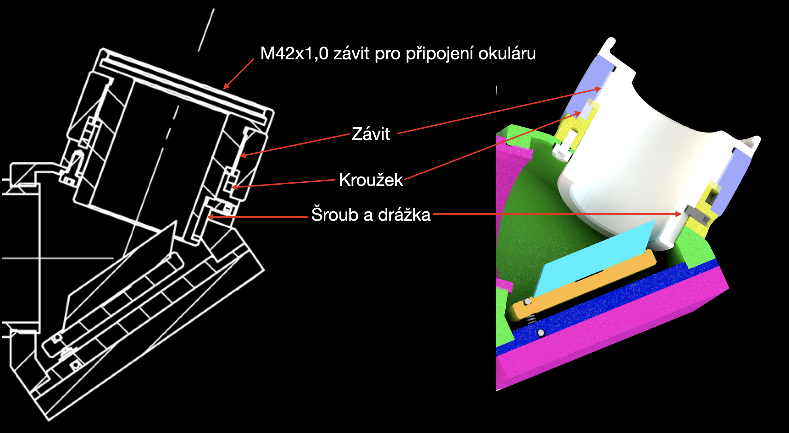
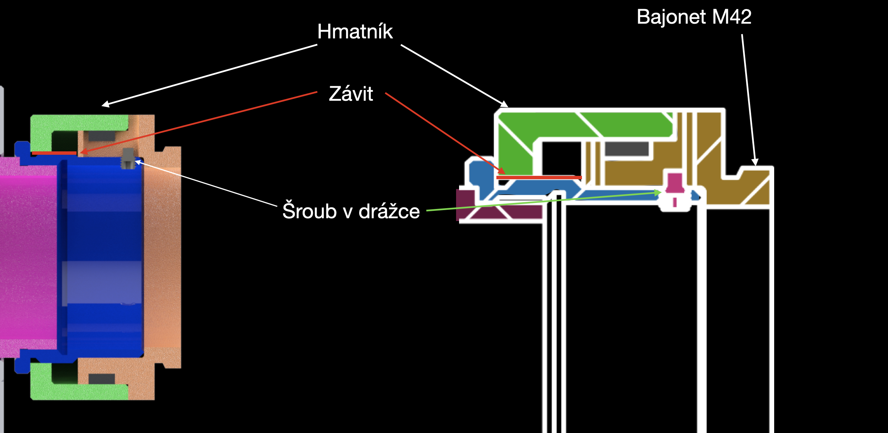

# Projekt dalekohledu pro předmět TKC

__Co tu naleznete?__

- [Zemax](zemax) - simulace optických vlastností v programu Zemax Optic studio
- [CAD](CAD) - soubory jednotlivých dílů a sestavy v Solidworks
- [imgs](imgs) - ilustrace a obrázky pro tento dokument
- [parts](parts) - dokumentace od výrobce vybraných použitých dílů.

Dalekohled se bude skládat z objektivu a okuláru s určením pro pozemní pozorování. Jako převracecí mechanismus bude použito zrcátko.

[Stránky Meopty](https://eshop.meopta.cz/spektivy/) s inspirací.

## Rozvržení

Konstrukce je inspirována spektivem [Meopta MeoStar S2](https://eshop.meopta.cz/spektivy-meostar-s2/spektiv-meostar-s2-82-hd-sikmy/) tento spektiv má ohniskovou vzdálenost objektivu 439 mm.

Jako objektiv bude sloužit achromatický dublet. Například firma Edmund Optics [nabízí](https://www.edmundoptics.com/c/achromatic-lenses/652/#29374=29374_s%3ANS4wMCAtIDUuOTk1&29374=29374_s%3ANC4wMCAtIDQuOTk1&27560=27560_s%3AVklTIDAmZGVnOyAoNDI1LTY3NW5tKQ2&27560=27560_s%3AVklTLU5JUiAoNDAwLTEwMDBubSk1&27560=27560_s%3ATWdGPHN1Yj4yPC9zdWI-ICg0MDAtNzAwbm0p0&27560=27560_s%3ATWdGPHN1Yj4yPC9zdWI-ICg0MDAtNzAwbm0p0&27560=27560_s%3AVklTIDAmZGVnOyAoNDI1LTY3NW5tKQ2&27560=27560_s%3AVklTLU5JUiAoNDAwLTEwMDBubSk1&27560=27560_s%3AVVYtVklTICgzNDUtNzAwbm0p0&27614=27614_d%3A%5B59.18%20TO%2089.47%5D) takové dublety, které vyhovují průměrem ohniskem. Další výhodou je knihovna dílů v programu Zemax Optics Studio.

Jako okulár se jeví vhodné použít [okulár 20-60x od společnosti Meopta](https://eshop.meopta.cz/spektivy-meostar-s1/okular-20-60x/), navíc spektiv MeoStar S1 má ohniskovou vzdálenost objektivu podobnou námi zvlené vzdálenosti (f' = 329 mm). Díky tomu, že okulár umožňuje zoomovat není zapotřebí měnit okuláry, což umožní redukovat množství prachu, které si při výměně do tubusu dostane.

## Výběr komponent a simulace v programu Zemax

### Objektiv

Z nabídky [vhodných achromatických dubletů](https://www.edmundoptics.com/c/achromatic-lenses/652/#29374=29374_s%3ANS4wMCAtIDUuOTk1&29374=29374_s%3ANC4wMCAtIDQuOTk1&27560=27560_s%3AVklTIDAmZGVnOyAoNDI1LTY3NW5tKQ2&27560=27560_s%3AVklTLU5JUiAoNDAwLTEwMDBubSk1&27560=27560_s%3ATWdGPHN1Yj4yPC9zdWI-ICg0MDAtNzAwbm0p0&27560=27560_s%3ATWdGPHN1Yj4yPC9zdWI-ICg0MDAtNzAwbm0p0&27560=27560_s%3AVklTIDAmZGVnOyAoNDI1LTY3NW5tKQ2&27560=27560_s%3AVklTLU5JUiAoNDAwLTEwMDBubSk1&27560=27560_s%3AVVYtVklTICgzNDUtNzAwbm0p0&27614=27614_d%3A%5B59.18%20TO%2089.47%5D)) firmy Edumnd Optics byl vybrát [dublet](https://www.edmundoptics.com/p/75mm-dia-x-400mm-fl-vis-0deg-coated-achromatic-lens/30848/) s ohniskovou vzdáleností 400 mm a průměru 75 mm s vrstvou propouštející viditelné vlnové délky (400 - 700 nm).

Jelikož je dalekohled určen pro pozemní pozorování, tak je zapotřebí použít jako kameru vhodný fotoaparát. Samotný dublet nemusí mít velké zorné pole, proto stačí použít fotoaparát s čipem micro 4/3, například [Panasonic Lumix GHS5](https://www.fotoskoda.cz/panasonic-lumix-dc-gh5s/). Rozměry čipu 17,3 na 13 mm znemenají, že nejvzdálenější objekt od osy bude 10,8 mm. 

> podle wiki _flange focal distance of 19.25mm_

Při simulaci je zapotřebí počítat se závitovým kroužkem upínajícím objektiv do objímky, proto byla zvolena apertura o průměru 73 mm. Při simulaci bylo simulováno zobrazení osového předmětu a dále předmětů vzdálených 1° a 1,5° od osy pro pokrytí celého čipu. 

Ze spot diagramu lze vidět, že pokud chceme získat kvalitní obraz předmětu umístěného uprostřed zorného pole stačí velikost pixelu okolo 10 μm. To lze ostatně taktéž vidět na závislosti funkce přenosu kontrastu (MTF - Modulated Transfer Funkction) na zorném poli. O clonách pro odstínění parazitních paprsků bude pojednáno později.

### Okulár a pozorování okem. 

Při pozorování okem poskytuje samotný objektiv zorné pola max 2,4° Při použití většího zorného pole, je zklenutí pole větší jak podélná sférická vada.

Pro převrácení obrazu bylo jako převracecí mechanizmus vybráno zenitové zrcátko. Okulár má ohniskovou vzdálenost 16,2 až 5,55 mm a pro použitý objektiv s ohninskem 400 mm získáváme zorné pole od 1,48° do 0,74° (velikost předmětu v polní rovnině od 5,17 mm do 2,584 mm). Při návrhu mechanické části je počítáno, že ohnisková rovina se nachází v rovině vstupní pupily. Schéma lze vidět na následujícím obrázku.

Poloha okuláru je volena tak, aby okulár zobrazoval polní rovinu do konvenční zrakové vzdálenosti 250 mm. Při použití delšího ohniska okuláru (16,2 mm) vzniknou v této rovně stopy velké zhruba 300 μm.

Funkce přenosu kontrastu bude vypadat následujícně.

Při použití nejkratšího ohniska okuláru 5,17 mm se vlivem vinětace omezí zorné pole na zhruba 0,4°.

V této rovině vznikají stopy velké zhruba 300 μm.

### Výpočet ostřícího rozsahu

Z rovnice paraxiální čočky lze vypočítat rozsah výsuvu potřebný pro ostření mězi nekonečněm a předmětem umístěným ve vzdálenosti 20 m. Pro předmět umístěný v 20 metrech vychází obrazová vzdálenost a' = f' + 8,141 mm. Dále je zapotřebí započítat korekci vad oka v rozsahu 4D. Užitím vztahu ze strany 19 [[1](#lit)] zjistíme, že při použití delšího ohniska 16,2 mm vyžaduje korekce vady přidání dalších 0,4 mm k výsuvu a to na obě strany.

|předmnětová vzdálenost| vzdálenost obrazu od ohniska| vzdálenost s korekcí pro 4D|
|---------------------:|----------------------------:|---------:|
| inf |     0 mm| - 0,400 mm|
|20 m | 8,141 mm | 8,541 mm|

Při tvorbě mechanického návrhu je dále počítáno s 0,5 mm rezervou, tak aby šlo přeostřit "za nekonečno" i před 20 m.

## Návrh mechanické konstrukce

Pro mechanickou konstrukci jsem volil rozvržení jak lze vidět na obrázku níže. Pro podrobnější vhled doporučuji nahlédnout do [výkresu sestav](CAD/drawings/TKC_000.pdf). 

Objektiv je uložen v objímce, která je závitem připojená k tubusu. Detail uložení lze vidět na následujícím obrázku.

Tubus je nevržený tak, aby tvarem ušetřil materiál a byl zároveň co nejrobustnější. Bohužel však tato konstrukce je obrížně vyrobitelná. Proto pro případ výroby je vhodné vytvořit tubus podle následujícího schématu.

Každá z částí by byla zhruba 10 cm dlouhá, proto by byla snáze vyrobitelná. Jednotlivé části by byly spojeny závitem a na prostřední rovné části by byla uplá přípojka na stativ, přičmž by pro režim fotografování snadno šlo vyvažovat soustavu.

Uvnitř kostky připojené k tubusu se nachází [eliptické zrcátko](https://www.edmundoptics.com/p/elliptical-mirror-2223mm-minor-axis-protected-aluminum/1919/) od firmy Edmund Optics. Pro obsažení celého pole je zapotřebí zrcátko s hlavní poloosou 14 mm a vedlejší poloosou 8 mm, což vybrané zrcátko pohodlně splňuje.

Zrcátko je upevněno na tříbodém justážním mechanizmu, kdy va šouby s jemným stoupáním tlačí proti pružinkám. Pružinky jsou zajištěny kolíky a jako osa rotace slouží kalená kulička. Destička s zrcátkem je přikryta krytem, aby se dovnitř kostky nedostávaly nečistoty zároveň aby nebyly odkrety justážní šrouby.

Okulárový výsuv je řešen pomocí závitu. Hmatník je pomocí dvou C-prstenců připevněn k statickému dílu a pomocí závitu na vnitřní straně se posouvá vnitřní díl. Ve vnitřním dílu je drážka, která omezuje pohyb dílu.

Při fotografování je zapotřebí odšroubovat kostku se zenitovým zrcátkem a připojit výsuv zakončený M42 bajonetem. Výsuv je řešen obdobně jako v případě okuláru.

### Materiály a další úpravy

Jako materiál byla u většiny dílů volena hliníková slitina EN AW 2030 nebo 5083. Díly je zapotřebí po obrábění eloxovat. Pro případné požadavky přesné výroby vybraných ploch je vhodné nechat před eloxací drobný přídavek a požadované plochy po eloxaci doobrobit. 

## Závěr

Byl úspěšně navržen čočkový dalekohled keplerova typu. Pro dalekohled byl vybrán vhodný objektiv a okulár. Pomocí počítačové simulace byly zjištěny jeho optické vlastnosti. Následně bylo vypočítán rozsah výsuvu potřebný pro pozorování objektů mezi nekonečnem a 20m. Byl vypočítán rozsah potřebný pro korekci zrakových vad do 4 D. Následně byla navržena mechanická konstrukce dalekohledu. Pro potřeby výroby byly vytvořeny výrobní výkresy vybraných dílů a výkres sestavy.

## Literatura 

[1] Liška Miroslav: _Optické sešity_ [cit. 24.5.2021] url: http://physics.fme.vutbr.cz/files/vyuka/OptPristroje/OP7_Zakladni%20opticke%20pristroje.pdf

> odhadem vstupní pupila průměr 40,5

> [trubka](https://www.ehlinik.cz/hlinikove-trubky/kat-E300000101.html)
> __Průměr filtru a stoupání:__ Most often refers to 0.75 mm pitch thread, but an (incompatible) (wiki)

> [Zrcátko](https://www.edmundoptics.com/p/elliptical-mirror-2223mm-minor-axis-protected-aluminum/1919/) 
> V reálu je potřebná hlavní poloosa 14 mm (celkem 28) a vedlejší 8 mm (celk 16)

> Správně pojmenovat soubory s kroužky - jsou normované! [odkaz](https://www.dolezal-pe.cz/data/cf5/000355_000162.pdf)

> Ostřící rozsah [PDFko str 19](http://physics.fme.vutbr.cz/files/vyuka/OptPristroje/OP7_Zakladni%20opticke%20pristroje.pdf)

> _ohnisko okuláru 16,2 mm_ znamená opravit ostřící rozsah rozsah o +/- 0,4 mm, 
> _ohnisko okuláru 5,55 mm_ znamená opravit rozsah o +/- 0,123 mm
> __celkově je zapotřbí oprava o +/- 0,4 mm__

nyní hordnoty bez korekce

> __Volíkm ostření na 20 metrů__ už tak není moc místa

| předmětová vzdálenost| vzdálenost obrazu od ohniska s korekcí|
|------------:|--------------:|

> nekonvenční technologie http://www.techmagazin.cz/2332
------------------
__!! staré !!__
-----------------

__Možnosti__

[Vyhledávání v Edmundu s výsledky pro objektiv](https://www.edmundoptics.com/c/achromatic-lenses/652/#29374=29374_s%3ANS4wMCAtIDUuOTk1&29374=29374_s%3ANC4wMCAtIDQuOTk1&27560=27560_s%3AVklTIDAmZGVnOyAoNDI1LTY3NW5tKQ2&27560=27560_s%3AVklTLU5JUiAoNDAwLTEwMDBubSk1&27560=27560_s%3ATWdGPHN1Yj4yPC9zdWI-ICg0MDAtNzAwbm0p0&27560=27560_s%3ATWdGPHN1Yj4yPC9zdWI-ICg0MDAtNzAwbm0p0&27560=27560_s%3AVklTIDAmZGVnOyAoNDI1LTY3NW5tKQ2&27560=27560_s%3AVklTLU5JUiAoNDAwLTEwMDBubSk1&27560=27560_s%3AVVYtVklTICgzNDUtNzAwbm0p0&27614=27614_d%3A%5B59.18%20TO%2089.47%5D). 

- [kandidát na objektiv](https://www.edmundoptics.com/p/75mm-dia-x-400mm-fl-vis-0deg-coated-achromatic-lens/30848/) f' = 400 mm, prum. 75 mm (f# 5,3) 300 €
- [náhradník na objektiv](https://www.edmundoptics.com/p/75mm-dia-x-300mm-fl-vis-nir-coated-achromatic-lens/30852/)

### Okulár

Pro Kellnerovu konstrukci okuláru

__První čočka:__
 - [Thorlabs best Form](https://www.thorlabs.com/thorproduct.cfm?partnumber=LBF254-040-A) 50 €
 - [Thorlabs aspheric](https://www.thorlabs.com/thorproduct.cfm?partnumber=AL2550G-A) 290 €

__Druhá čočka:__
 - [Thorlabs achromatický dublet](https://www.thorlabs.com/newgrouppage9.cfm?objectgroup_id=120) f' = 19 mm prum. 12,75 mm (zv. 30x)
 - [Thorlabs achromatický dublet](https://www.thorlabs.com/thorproduct.cfm?partnumber=AC080-016-A) f' = 16 mm prum. 12,75 mm (zv. 35x)

Dále je v nabídce dublet s ohniskem 10 mm následné zv. 50 x.

> __Možný plán:__ navrhnout vícero okulárů s různými zvětšeními. Prvotním cílem bude zvětšení 20-30x

- [kandidát na okulár](https://www.edmundoptics.com/p/25mm-dia-x-40mm-fl-mgfsub2sub-coated-achromatic-doublet-lens/2285/)

> * [edmund](https://www.edmundoptics.com/c/achromatic-lenses/652/#27560=27560_s%3ATWdGPHN1Yj4yPC9zdWI-ICg0MDAtNzAwbm0p0&27560=27560_s%3AVklTIDAmZGVnOyAoNDI1LTY3NW5tKQ2&27560=27560_s%3AVklTLU5JUiAoNDAwLTEwMDBubSk1&27560=27560_s%3AVVYtVklTICgzNDUtNzAwbm0p0&27614=27614_d%3A%5B89.04%20TO%20140.00%5D)
> * [nejlepší kandidát od Edmundu](https://www.edmundoptics.com/p/90mm-dia-x-8499mm-fl-achromatic-lens-mtd-/11255/) za něj přidat [toto](https://www.edmundoptics.com/p/635mm-dia-x-3549mm-fl-achromatic-lens/2017/) pro zkrácení, případně si pomoct [pozitivním meniskem](https://www.thorlabs.com/newgrouppage9.cfm?objectgroup_id=130)
> * [čočka f_1](https://www.edmundoptics.com/p/25mm-dia-x-25mm-fl-mgfsub2sub-coated-achromatic-doublet-lens/20105/) prum 25 mm ohnisko 25

## Literatura 

[1] Liška Miroslav: _Optické sešity_ [cit. 24.5.2021] url: http://physics.fme.vutbr.cz/files/vyuka/OptPristroje/OP7_Zakladni%20opticke%20pristroje.pdf

------

[1] Fuka Josef, Havelka Bedřich: _Optika a atomová fyzika_. SPN Praha 1961.

[2] Born Max, Wolf Emil: _Principles of optics_. Seventh anniversary ed, Cambridge University Press 2019.
